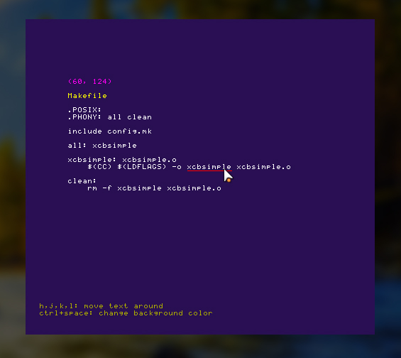

# xcbsimple



## Description

xcbsimple is a simple xcb application that showcases common xcb tasks (input handling, rendering pixels directly, etc).

## Dependencies

To compile and run xcbsimple, you need the following libraries installed:

- libxcb
- libxcb-image
- libxcb-keysyms

## Build and run

```sh
$ make && ./xcbsimple
```

## License

Code is licensed under GNU's General Public License v2. See `COPYING` for details.
